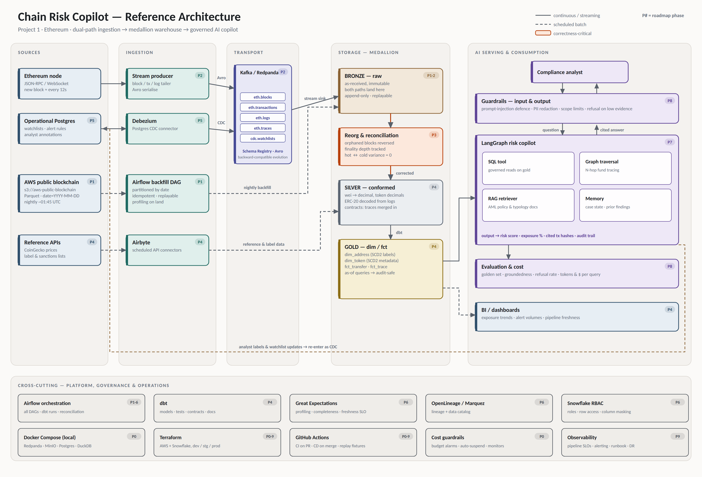

# Data & AI Engineering Program — Roadmap

Owner: Arpit · Started: 2026-09-04 · Root: `D:\Projects\data-engineering`

A program of industry-level projects taken from development to production, each
exercising both Data Engineering and AI Engineering at architect level.

---

## Locked decisions for Project 1

| Decision | Choice | Why |
|---|---|---|
| Real-time strategy | Live Ethereum RPC/websocket (hot) + S3 Parquet (cold) | The AWS public dataset is batch Parquet. Real streaming must come from a node. Two paths force genuine hot/cold reconciliation. |
| Environment | Local-first Docker, promote to cloud per phase | Iteration speed and cost control. Terraform written from day one, applied deliberately. |
| AI product | Wallet Risk & Fund-Tracing Copilot | Gives the data model a job. Justifies SCD2 labels, RBAC, guardrails, evaluation. |
| Chain | Ethereum | Richest data (transactions, logs, tokens, contracts), best public label ecosystem. |

---

## Project 1 — Chain Risk Copilot

**One line:** A governed, real-time Ethereum data platform that powers an
AML-style copilot which traces funds, scores wallet risk, and produces
audit-ready, evidence-cited findings.

### Phase ladder

Each phase ships something runnable. Each concern is introduced at the phase
where it actually bites — not as a standalone lesson.

| # | Phase | Ships | Architect concerns it forces |
|---|---|---|---|
| 0 | Foundations | Repo scaffold, Docker Compose stack, Terraform skeleton, CI, secrets, budget alarms | DevOps, environments, cost guardrails |
| 1 | Cold path | Airflow DAG: S3 Parquet → bronze, partitioned backfill | Ingestion, idempotency, profiling, completeness |
| 2 | Hot path | RPC websocket → Kafka producer → bronze sink, Schema Registry | Real-time, schema evolution, delivery semantics |
| 3 | Correctness | Reorg handling, finality tracking, hot/cold reconciliation | Late-arriving data, corrections, pipeline SLOs |
| 4 | Warehouse | dbt medallion: silver/gold, `dim_address` (SCD2), `dim_token`, `fct_transfer` | Dimensional modeling, SCD, data contracts |
| 5 | Operational CDC | Postgres (watchlists, labels, annotations) → Debezium → Kafka → warehouse | CDC — on data that genuinely changes |
| 6 | Governance | dbt tests + Great Expectations, freshness SLOs, OpenLineage, catalog, Snowflake RBAC + masking | Quality, metadata management, RBAC |
| 7 | Agent | LangGraph copilot: SQL tools, graph traversal, RAG over AML policy docs, memory | Agent design, tool routing, memory management |
| 8 | AI safety & eval | Input/output guardrails, prompt-injection defence, golden-set eval harness, token cost tracking | AI guardrails, evaluation, LLM cost optimization |
| 9 | Production | Terraform apply to AWS + Snowflake, GitHub Actions CD, observability, DR, runbook | Release engineering, operability |

### Architecture at a glance



*Full-resolution vector: `architecture.svg`. Phase badges (P0–P9) on each component map
to the phase ladder above.*

<details>
<summary>Text version</summary>

```
                 ┌──────────────── HOT PATH ────────────────┐
Ethereum node ──▶│ RPC/WS producer ──▶ Kafka ──▶ stream sink │──┐
                 │        (Avro + Schema Registry)           │  │
                 └───────────────────────────────────────────┘  │
                                                                ▼
s3://aws-public-blockchain/v1.0/eth/ ──▶ Airflow backfill ──▶ BRONZE (raw, immutable)
                 └──────────── COLD PATH ────────────┘           │
                                                                 ▼
CoinGecko / label & sanctions lists ──▶ Airbyte ──────────▶  SILVER (dbt: cleaned, conformed)
                                                                 │
Postgres (watchlists, analyst labels) ──▶ Debezium ──▶ Kafka ────┤
                                                                 ▼
                                                         GOLD (dbt: dim/fct, SCD2)
                                                                 │
                                          ┌──────────────────────┴──────────────────┐
                                          ▼                                         ▼
                             LangGraph Risk Copilot                          BI / dashboards
                        (SQL + graph traversal + RAG + memory)
```

</details>

### Why reorgs, not synthetic CDC

Chain data is append-only and immutable, so CDC and SCD do not arise naturally
from it. Forcing them there teaches the mechanics but not the judgement. Instead:

- **Reorgs** are the real mutability: a block is orphaned and its transactions
  un-happen. Combined with the pending → confirmed → finalized lifecycle, this is
  the authentic late-arriving-data, correction and idempotency problem.
- **SCD2** lives where things genuinely change slowly: wallet/entity labels,
  token metadata (proxy upgrades alter symbol/decimals), address risk scores.
- **CDC** lives in the operational Postgres that the copilot writes to —
  watchlists, alert rules, analyst annotations. A real CDC source, not a prop.

### Tool assignments (and one deliberate correction)

| Tool | Job here |
|---|---|
| Kafka / Redpanda | Live chain events, CDC stream |
| Airflow | Batch backfill, reconciliation, dbt orchestration |
| Airbyte | Reference/enrichment APIs only — prices, label lists, sanctions lists |
| dbt | Silver/gold modeling, tests, contracts, docs |
| Snowflake | Warehouse, RBAC, masking, resource monitors |
| DuckDB | Local warehouse stand-in for fast dev |
| Debezium | Postgres CDC |
| LangChain / LangGraph | Copilot orchestration, tools, memory |
| Terraform | All cloud infrastructure |
| GitHub Actions | CI/CD |

Airbyte is deliberately **not** used for the Parquet or streaming ingest — it fits
neither. Choosing not to use a tool is part of the exercise.

---

## Later projects (sketch — to be briefed when Project 1 reaches Phase 4)

| # | Project | Domain shift it forces |
|---|---|---|
| 2 | IT/OT Convergence — Predictive Maintenance | Sensor time-series, edge ingestion, ML serving, ERP joins |
| 3 | Patient/Member 360 | Heavy unstructured docs, de-identification, PII governance, cited retrieval |
| 4 | Customer 360 & Next Best Action | Entity resolution at scale, call transcripts, recommendation serving |

---

## Cost guardrails (Phase 0 deliverables, not an afterthought)

- Everything runs locally by default; cloud is opt-in per phase.
- AWS budget alarm + cost anomaly detection before any `terraform apply`.
- Snowflake: XS warehouse, 60s auto-suspend, resource monitor with hard cap.
- LLM: token accounting per request, prompt caching, small-model routing for
  classification steps, cost surfaced in the eval harness.
